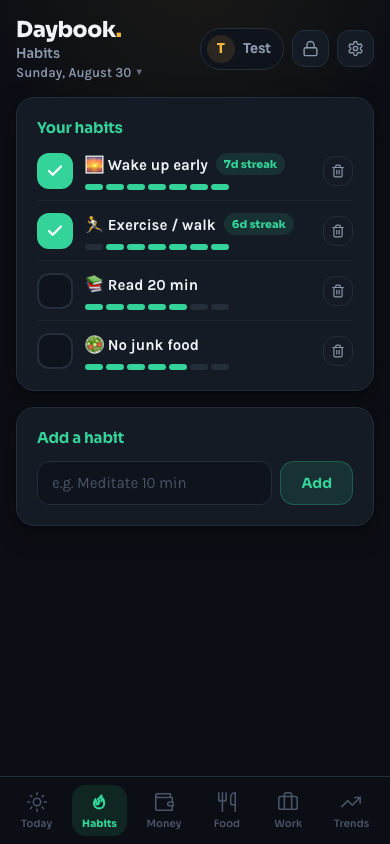
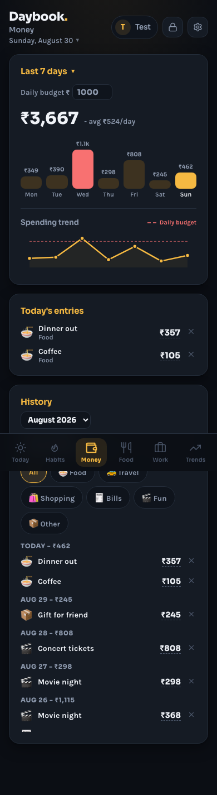
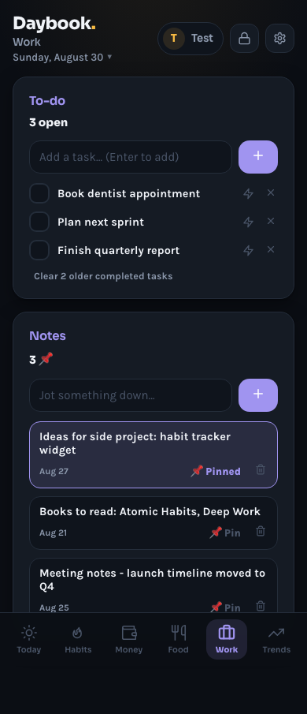
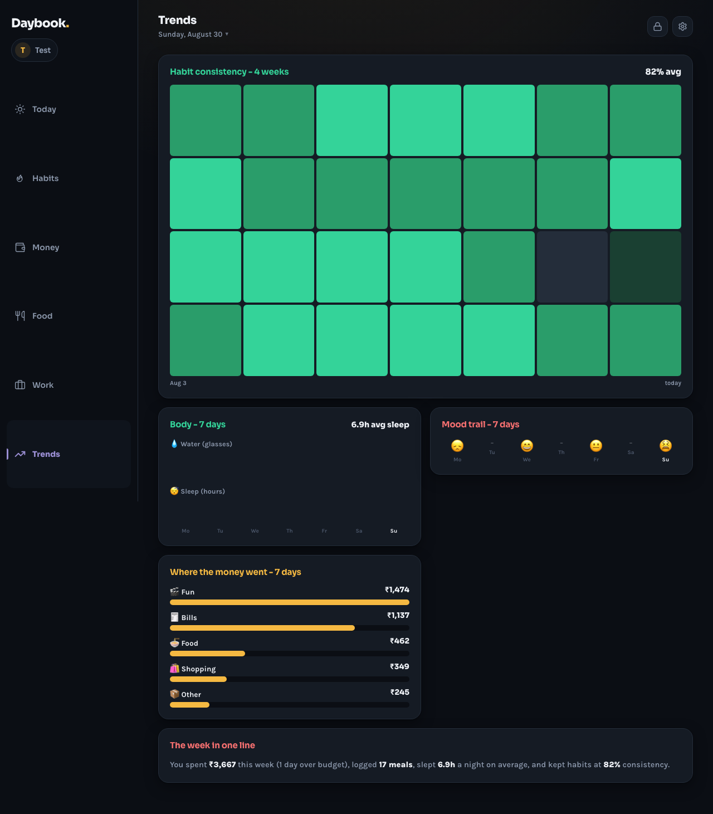

# Daybook - Life OS

Your private daily Life OS. Habits, money, food, work, and wellness in one place - **local-first**, with **optional encrypted sync** across devices.


## Screenshots

| Today (mobile) | Habits (mobile) | Money (mobile) |
|:---:|:---:|:---:|
|  |  |  |

| Work (mobile) | Today (desktop) | Trends (desktop) |
|:---:|:---:|:---:|
|  |  |  |

## Try it in 30 seconds

```bash
npm install
npm run dev
```

Open [http://localhost:5173](http://localhost:5173) and tap **Login as Test - sample data** to explore a fully populated demo profile.

## Why Daybook?

| | Daybook | Typical tracker apps |
|---|---------|---------------------|
| **Privacy** | Local-first; sync is encrypted end-to-end | Cloud reads your data |
| **Speed** | Instant open, offline PWA | Login, sync waits |
| **Household** | Multiple profiles on one device | One account per install |
| **Cost** | Free static hosting + Netlify free tier | Subscriptions |

## Features

| Tab | Job (5 words) |
|-----|----------------|
| **Today** | Log your whole day fast |
| **Habits** | Track streaks and consistency |
| **Money** | Budget, charts, spending history |
| **Food** | Meal quality and eating score |
| **Work** | Tasks and searchable notes |
| **Trends** | See patterns unlock over time |

### Multi-user & PIN

- Each person gets their own habits, spending, meals, and notes
- Optional **4-digit PIN** per profile (device unlock + `/logs` access)
- PIN is registered server-side when set (for household admin recovery at `/admin`)
- **Switch person** from the lock icon without deleting anyone's data
- **Backup my profile** or **Backup everyone** as JSON

### Encrypted sync (Netlify)

Settings → **Sync across devices**:

1. **Turn on sync** - get a 24-character sync code (save it somewhere safe)
2. On another device: Settings → **Link this device** → paste the same code
3. Changes auto-sync every few seconds when online

- Data is **AES-GCM encrypted** in the browser before upload
- Stored in **Netlify Blobs** via `/.netlify/functions/sync`
- **Last-write-wins** across devices
- PINs stay hashed locally for unlock; plaintext PIN is only in admin registry when user sets/changes PIN

## Deploy (Netlify)

1. Push this repo to GitHub
2. [Netlify](https://app.netlify.com) → **Add new site** → Import the repo
3. Build: `npm run build` · Publish: `dist`
4. **Environment variables** (Site configuration → Environment variables):
   - `LOGS_ADMIN_KEY` — long random secret for `/admin`
   - Redeploy after adding env vars

`netlify.toml` includes functions for **sync**, **logs**, and **admin**.

### URLs after deploy

| URL | Who | Purpose |
|-----|-----|---------|
| `/` | Everyone | Main app |
| `/logs` | Users | View **your own** activity log (name + PIN) |
| `/admin?key=…` | Admin | User registry, PINs, delete users, view all logs |
| `/version` | Everyone | Build version info |
| `/versioninfo.txt` | Everyone | Plain-text version |

## Activity logs

**User view** — `/logs`

- Enter profile name + PIN (if you set one)
- See your own events (spends, habits, sync, errors, etc.)

**Admin** — `/admin`

- Requires `LOGS_ADMIN_KEY`
- See all users: created date, last activity, **PIN**, event count
- **Delete user** removes: activity logs, registry entry, encrypted sync blob
- Device clears that profile on next app open

Local dev: admin key defaults to `dev-admin`.

**Honest limits:** logs are metadata only (not full diary text). Admin delete cannot wipe another person's browser until they open the app.

## Data & privacy

All data lives in your browser under `localStorage` key `db_app`:

```json
{
  "version": 2,
  "users": [...],
  "activeUserId": "...",
  "userData": { "...": { habits, spends, meals, ... } }
}
```

- **Export** JSON or CSV from Settings
- **PINs** hashed locally for unlock; admin registry stores PIN when set/changed (household recovery)
- **Sync code** encrypts your backup - treat it like a password
- Destructive deletes show an **Undo** toast (5 seconds) across Money, Food, Habits, Work

## Project structure

```
src/
├── components/
│   ├── admin/      UserLogsPage, AdminPage, logFormat
│   ├── auth/       Welcome, user select, PIN
│   ├── layout/     Header, nav, settings
│   ├── ui/         Card, DayPulse, chips
│   └── views/      Today, Habits, Money, Food, Work, Trends
├── hooks/          Store, toast, habits, sync, activity logger
├── lib/            Storage, dates, auth, export, sync, userRegistry
netlify/functions/  sync.mjs, logs.mjs, admin.mjs
public/screenshots/ App screenshots for README
```

## Scripts

| Command | What it does |
|---------|--------------|
| `npm run dev` | Local dev (API mocks at `/api/sync`, `/api/logs`, `/api/admin`) |
| `npm run build` | Production build to `dist/` |
| `npm run preview` | Preview production build |
| `node scripts/screenshot-audit.mjs` | Capture mobile + desktop screenshots |

## Tech stack

- React 18 + Vite 6
- PWA via vite-plugin-pwa
- Netlify Functions + Blobs (sync, logs, admin registry)
- Optional Cloudflare Worker sync (`worker/`) if you prefer KV over Netlify

## License

MIT
